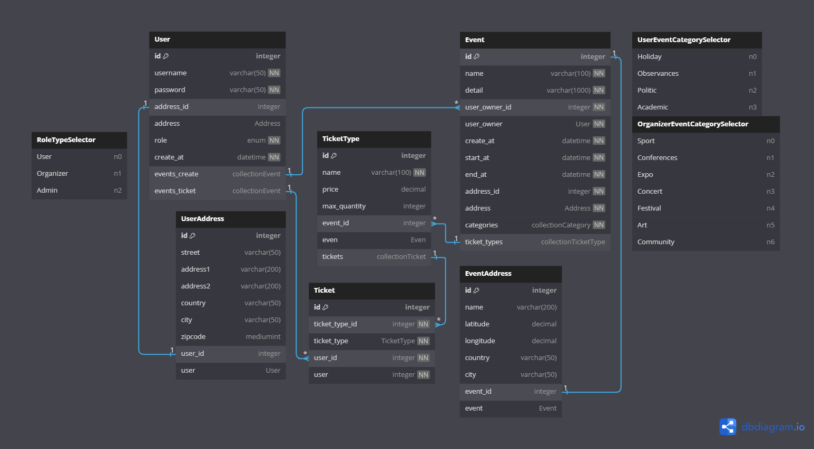

## Event Management System
### Features:
1. **User Registration and Authentication:** 
  - ⚫ Basic user registration and login functionality using ASP.NET Core Identity.
  - ⚫ Different roles for users, such as Admin and Regular User.
2. **Event Creation:** 
  - ⚫ An admin can create events with details such as title, description, date, location, and capacity.
  - ⚫ Basic form validation to ensure all fields are filled out correctly.
3. **Event Listing:** 
  - ⚫ A public page displaying a list of all upcoming events.
  - ⚫ Each event item should show the title, date, location, and a brief description.
4. **Event Details Page:** 
  - ⚫ A detailed view of each event, showing full information and an option to register (if capacity allows).
  - ⚫ Registration button/form for users to sign up for an event.
5. **User Event Registration:** 
  - ⚫ Logged-in users can register for events.
  - ⚫ Once registered, an event's capacity should decrease accordingly.
6. **Admin Dashboard:** 
  - ⚫ A page for admins to manage events: create, update, delete events.
  - ⚫ A list of users registered for each event.

.svg)
<!--  --!>
